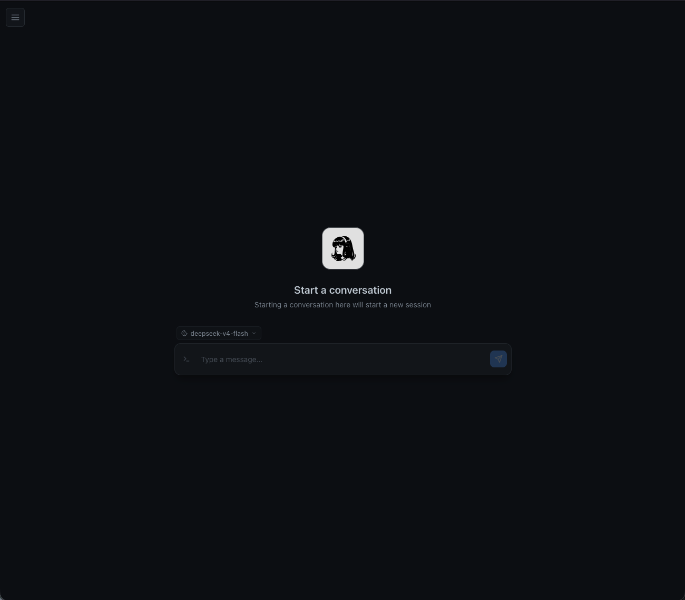
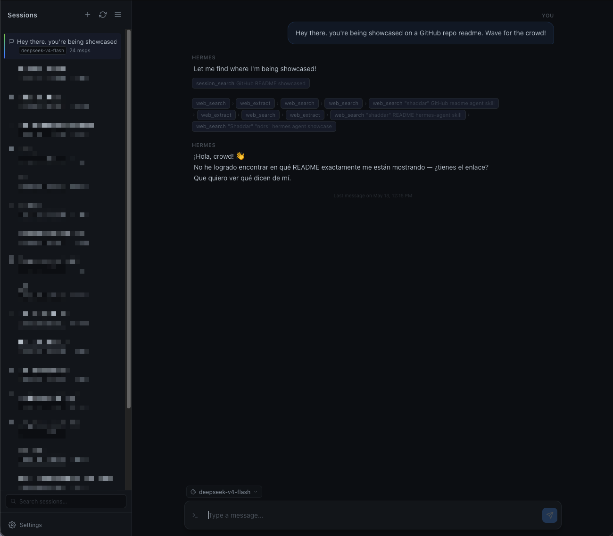
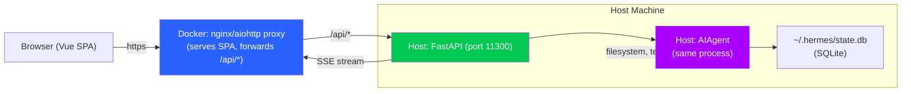

# Hermes Agent Web Chat

<p align="center">
  
  
  
</p>

A web chat interface for [Hermes Agent](https://github.com/NousResearch/hermes-agent). A **drop-in replacement for the TUI** (`hermes chat`) — same agent, same session database, same tools — but accessible from a web browser.

No terminal quirks. No overengineering. No weird over-scoping. Just a clean chat UI that works on desktop and mobile.

## What this is NOT

- ❌ **Not a multi-user platform** — single-shared-password auth, no user isolation
- ❌ **Not a rewrite of Hermes** — uses the exact same AIAgent/SessionDB classes
- ❌ **Not an OpenAPI proxy** — no wrapper layer that strips functionality
- ❌ **Not a SaaS** — runs on your machine, no telemetry, no cloud dependency
- ✅ **Just a damn chat** — the TUI, in a browser, nothing more

<p align="center">
  <a href="assets/main-scr-13-05-26.png" target="_blank">
    
  </a>
  <a href="assets/chat-scr-13-05-26.png" target="_blank">
    
  </a>
</p>

<p align="center"><em>As you can see... my agent is Spanish :)</em></p>

## Motivation

I created this project for myself, really. After trying different frontends I found that they don't solve what was for me the most basic thing: Usability.

- `hermes-webui`: forced workspace prompt wastes tokens, too slow & clunky, runs as a standalone hermes install with different values that I have on telegram or chat. 
- `hermes dashboard`: no auth, just proxies the terminal, unusable theme on mobile, bad contrast...
- `open-webui`: Uses hermes-agent OpenAPI-like api -> can't swap model
- etc...

## How it works

The Python backend uses the **exact same Hermes Agent classes** (`AIAgent`, `SessionDB`) that `hermes chat` uses. When you send a message:

1. The backend creates `AIAgent` with your configured model and session
2. The agent runs on the **host machine** — filesystem access, terminal commands, and tools work exactly as if you ran `hermes chat` in a terminal
3. Streaming responses arrive via Server-Sent Events (SSE) — real-time token streaming
4. Sessions are stored in the **same SQLite database** (`~/.hermes/state.db`) — CLI and web sessions coexist seamlessly. You can start something in the web UI and resume it in the terminal, or vice versa

No Hermes ports exposed. No config changes needed. The only difference is the UI.

### Architecture



Two deployment modes:

- **Bare-metal**: FastAPI serves both the API and the SPA directly — no Docker needed.
- **Docker + Traefik**: The Vue SPA runs in a lightweight container that proxies `/api/*` to the host backend. The agent itself always runs on the host so its tools (terminal, filesystem) see your real machine.

## Quick start

### Prerequisites

- A working [Hermes Agent](https://github.com/NousResearch/hermes-agent) installation at `~/.hermes/` with a configured provider (run `hermes setup` first)
- Python 3.11+

---

### Scenario 1 — Bare-metal (single machine, simplest)

Build the frontend once, then the backend serves everything on a single port.

```bash
# 1. Install backend deps
cd backend
pip install -r requirements.txt

# 2. Build the frontend
cd ../frontend
npm install && npm run build

# 3. Run the backend (serves the built SPA at /)
cd ../backend
HERMES_HOME=$HOME/.hermes \
HERMES_SRC=$HOME/.hermes/hermes-agent \
AUTH_PASSWORD=changeme \
uvicorn main:app --host 0.0.0.0 --port 11300
```

Open **http://localhost:11300** and log in. The FastAPI app statically serves the Vue SPA from `frontend/dist/` — no separate web server needed.

> The password can also be set via a `backend/.env` file (gitignored). See `backend/.env.example` for the format.

---

### Scenario 2 — Docker with Traefik + host backend

The Vue SPA runs in Docker, but the Python backend runs **directly on the host** so the agent's terminal tool sees your real filesystem.

#### 1 — Host backend (systemd)

```bash
sudo cp deploy/hermes-agent-web-chat-backend.service /etc/systemd/system/

# Create an environment file for the login password (outside the repo):
echo 'AUTH_PASSWORD=your-secret-password' | sudo tee /etc/hermes-agent-web-chat.env
sudo chmod 600 /etc/hermes-agent-web-chat.env

sudo systemctl daemon-reload
sudo systemctl enable --now hermes-agent-web-chat-backend.service
```

Backend listens on port **11300** (not exposed to the internet).

> **Why not put the password in the service file?** The systemd unit is tracked by git. Using `EnvironmentFile` keeps secrets outside the repo. The service file is already configured with `EnvironmentFile=/etc/hermes-agent-web-chat.env` — just uncomment it if you copy a fresh version.

#### 2 — Container (SPA + API proxy)

```bash
docker build --no-cache-filter=frontend -t hermes-agent-web-chat .
docker run -d --name hermes-ndrs-es --restart unless-stopped \
  -e BACKEND_HOST=172.17.0.1 \
  -e BACKEND_PORT=11300 \
  -l traefik.enable=true \
  -l traefik.frontend.rule=Host=hermes.yourdomain.com \
  -l traefik.port=11300 \
  -l traefik.protocol=http \
  hermes-agent-web-chat
```

The container serves the SPA and proxies `/api/*` to the host. Traefik terminates TLS.

> `BACKEND_HOST` is typically `172.17.0.1` (Docker gateway). On macOS/Windows use `host.docker.internal`.

---

### Scenario 3 — Dev mode (hot-reload)

Two terminals — backend with auto-reload, frontend with Vite HMR and API proxy.

```bash
# Terminal 1 — backend (hot-reload on Python changes)
cd backend
HERMES_HOME=$HOME/.hermes \
HERMES_SRC=$HOME/.hermes/hermes-agent \
AUTH_PASSWORD=changeme \
uvicorn main:app --host 0.0.0.0 --port 11300 --reload

# Terminal 2 — frontend (HMR with API proxy to backend)
cd frontend
npm install && npm run dev
```

Open **http://localhost:5173** — Vite proxies `/api/*` requests to `localhost:11300` automatically.

No Docker needed during development. Changes to Python files auto-reload the backend; changes to Vue files reflect instantly via Vite HMR.

---

### Configuration

| Env var | Default | Description |
|---------|---------|-------------|
| `AUTH_PASSWORD` | `changeme` | Login password (required) |
| `HERMES_HOME` | `~/.hermes` | Hermes Agent data directory |
| `HERMES_SRC` | `$HERMES_HOME/hermes-agent` | Hermes Agent source path |
| `PORT` | `11300` | HTTP listen port |
| `DEBUG` | `false` | Enable debug endpoints (`/api/debug/*`) |
